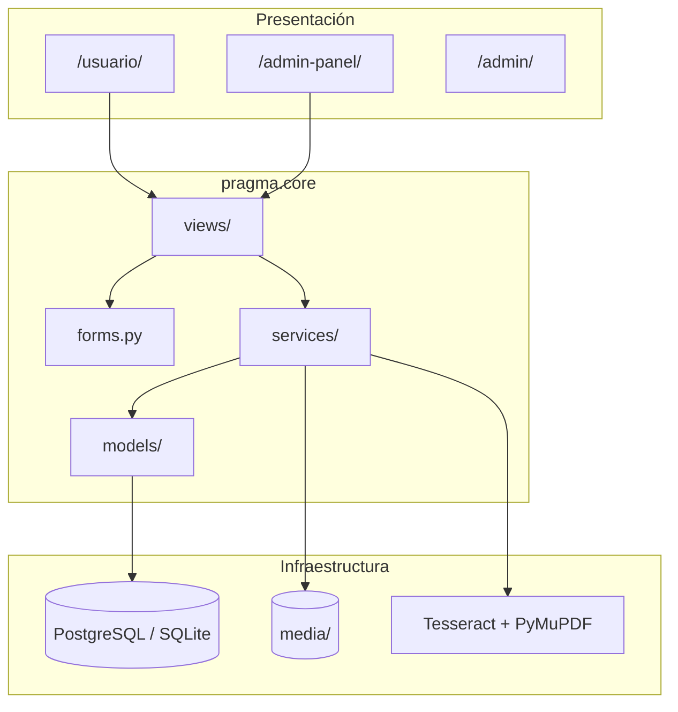
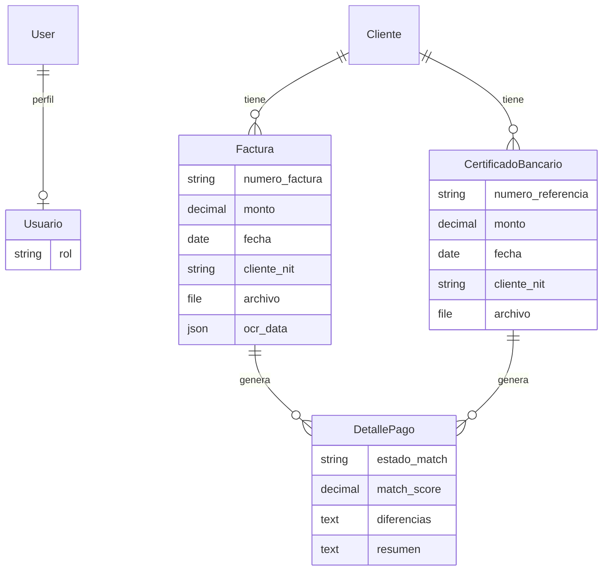
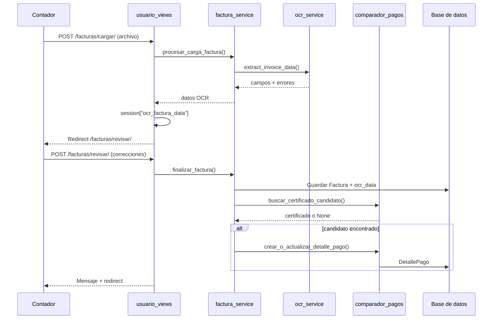
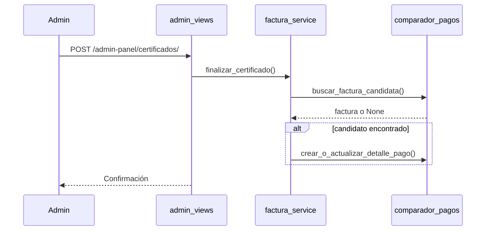

# Arquitectura de Pragma

Pragma es una aplicación web Django para firmas contables pequeñas. Automatiza la lectura OCR de facturas, la comparación contra certificados bancarios y la generación de métricas y exportes para acelerar la verificación de pagos.

---

## Resumen ejecutivo

### Problema

Las firmas contables dedican **2–4 horas por cliente** a verificar pagos de forma manual: revisar facturas, certificados bancarios y archivos de pago. El proceso es lento, propenso a errores y depende casi por completo de intervención humana.

### Solución

Un **monolito Django** que:

1. Extrae datos de facturas (PDF/PNG/JPG) mediante OCR.
2. Permite revisión y corrección humana de los campos extraídos.
3. Compara facturas con certificados bancarios por NIT, monto y fecha.
4. Expone un dashboard de métricas y exportes PDF/Excel.

**Objetivo de negocio:** reducir el tiempo de procesamiento a aproximadamente **15 minutos** por cliente (frente a 2–4 horas manuales).

### Alcance actual (MVP)

- Una sola aplicación Django (`pragma.core`).
- Interfaz server-rendered (sin SPA ni API REST pública).
- OCR solo en **facturas**; certificados se capturan manualmente en el panel admin.
- Localización Guatemala: `es-gt`, zona horaria `America/Guatemala`, patrones OCR con quetzales (`Q`).

---

## Stack tecnológico

| Capa | Tecnología |
|------|------------|
| Lenguaje | Python 3.11+ |
| Framework | Django ≥ 4.2 |
| Base de datos | PostgreSQL 15 (Docker/producción) o SQLite (`USE_SQLITE=True`) |
| ORM | Django ORM |
| Plantillas | Django Templates + CSS en `base.html` |
| Formularios | Formularios Django manuales en templates (`django-crispy-forms` instalado pero no usado en vistas) |
| Autenticación | `django.contrib.auth` (sesiones) |
| OCR | Tesseract (`pytesseract`) + PyMuPDF (`fitz`) + Pillow |
| Exportes | ReportLab (PDF), openpyxl (Excel) |
| Contenedores | Docker + Docker Compose |
| WSGI (prod) | Gunicorn (en `requirements.txt`; Docker dev usa `runserver`) |

**No incluido:** Node.js, React/Vue, DRF, GraphQL, Celery, Redis, CI/CD en el repositorio.

---

## Patrón arquitectónico

Pragma sigue un **monolito en capas** dentro de un único repositorio:

```
HTTP Request
    → urls.py (enrutamiento)
    → views (usuario_views / admin_views)
    → forms (validación de entrada)
    → services (lógica de negocio)
    → models (persistencia)
    → templates (respuesta HTML)
```

La lógica de negocio vive en `pragma/core/services/`. Las vistas permanecen delgadas: orquestan formularios, sesiones, mensajes flash y llamadas a servicios.



---

## Estructura del repositorio

```
pragma/                          # Raíz del proyecto
├── manage.py                    # CLI de Django
├── requirements.txt             # Dependencias pip
├── Dockerfile                   # Imagen Python 3.11 + Tesseract
├── docker-compose.yml           # Servicios web + PostgreSQL
├── .env.example                 # Plantilla de variables de entorno
├── datos_ficticios.py           # Wrapper del comando de seed
├── pragma/                      # Paquete del proyecto Django
│   ├── settings.py              # Configuración global
│   ├── urls.py                  # Enrutamiento raíz
│   ├── wsgi.py                  # Punto de entrada WSGI
│   └── core/                    # Única app de dominio
│       ├── models/              # Entidades de negocio
│       ├── views/               # Vistas HTTP
│       ├── services/            # Lógica de negocio
│       ├── forms.py
│       ├── permissions.py       # Control de acceso admin-panel
│       ├── admin.py             # Registro Django admin
│       ├── migrations/
│       ├── management/commands/
│       └── tests/
├── templates/                   # HTML (usuario + admin_panel)
├── static_src/                  # Assets estáticos fuente
├── sql/                         # SQL de ejemplo para seeds
└── docs/                        # Documentación (este archivo, ONBOARDING)
```

---

## Modelo de dominio

### Entidades

| Modelo | Archivo | Descripción |
|--------|---------|-------------|
| `Cliente` | `pragma/core/models/cliente.py` | Contribuyente: NIT (único), nombre, contacto |
| `Factura` | `pragma/core/models/factura.py` | Factura con campos extraídos, archivo y `ocr_data` (JSON) |
| `CertificadoBancario` | `pragma/core/models/certificado_bancario.py` | Certificado de pago bancario |
| `DetallePago` | `pragma/core/models/detalle_pago.py` | Resultado del matching factura ↔ certificado |
| `Usuario` | `pragma/core/models/usuario.py` | Perfil 1:1 con `User` de Django; rol `contador` o `admin` |

### Diagrama entidad-relación



`DetallePago` tiene restricción **unique** sobre el par `(factura, certificado)`.

---

## Superficies HTTP

### Enrutamiento raíz

Archivo: `pragma/urls.py`

| Ruta | Destino |
|------|---------|
| `/` | Redirección a `/usuario/dashboard/` |
| `/usuario/` | App de usuario final |
| `/admin-panel/` | Panel administrativo personalizado |
| `/admin/` | Django admin nativo |

### Usuario final (`/usuario/`)

Archivo: `pragma/core/urls_usuario.py` → `pragma/core/views/usuario_views.py`

| Ruta | Nombre | Función |
|------|--------|---------|
| `/usuario/login/` | `login` | Inicio de sesión |
| `/usuario/logout/` | `logout` | Cierre de sesión |
| `/usuario/dashboard/` | `dashboard` | Métricas agregadas |
| `/usuario/facturas/` | `consulta_facturas` | Búsqueda de facturas |
| `/usuario/facturas/cargar/` | `cargar_factura` | Subida + OCR |
| `/usuario/facturas/revisar/` | `revisar_factura` | Revisión humana post-OCR |
| `/usuario/pagos/` | `consulta_pagos` | Listado de matches |
| `/usuario/pagos/export/excel/` | `exportar_pagos_excel` | Exportación Excel |
| `/usuario/pagos/<id>/export/pdf/` | `exportar_pago_pdf` | Exportación PDF |

### Panel admin personalizado (`/admin-panel/`)

Archivo: `pragma/core/urls_admin.py` → `pragma/core/views/admin_views.py`

Requiere rol **admin** o superusuario (ver permisos).

| Ruta | Función |
|------|---------|
| `/admin-panel/` | Redirección a listado de facturas |
| `/admin-panel/facturas/` | CRUD facturas + flujo OCR |
| `/admin-panel/facturas/revisar/` | Revisión OCR (admin) |
| `/admin-panel/facturas/<id>/editar\|eliminar/` | Edición/eliminación |
| `/admin-panel/certificados/` | CRUD certificados bancarios |
| `/admin-panel/usuarios/` | CRUD usuarios del sistema |

Las descargas PDF/Excel no son una API JSON: son respuestas binarias generadas por vistas Django.

---

## Autenticación y autorización

### Mecanismo

- **Sesiones Django** (`SessionMiddleware`, cookies de sesión).
- Sin JWT, OAuth ni APIs de terceros para auth.

### Roles

| Rol | Código | Acceso |
|-----|--------|--------|
| Contador | `contador` | `/usuario/*` (dashboard, facturas, pagos, exportes) |
| Administrador | `admin` | Todo lo anterior + `/admin-panel/*` |
| Superusuario Django | — | Bypass del gate de admin-panel |

El perfil se accede vía `user.perfil` (`related_name="perfil"` en el modelo `Usuario`).

### Control de acceso

Archivo: `pragma/core/permissions.py`

- `ensure_admin_or_raise(request)`: lanza `PermissionDenied` (403) si el usuario no es superuser ni tiene `perfil.rol == "admin"`.
- Todas las vistas de `admin_views` usan `@login_required` + verificación de admin.

Configuración en `pragma/settings.py`:

- `LOGIN_URL = "/usuario/login/"`
- `LOGIN_REDIRECT_URL = "/usuario/dashboard/"`
- `LOGOUT_REDIRECT_URL = "/usuario/login/"`

---

## Flujos de negocio principales

### A. Carga de factura con OCR y matching automático



**Archivos clave:** `usuario_views.py` → `factura_service.py` → `ocr_service.py`, `comparador_pagos.py`

### B. Registro de certificado bancario (admin)

Los certificados **no pasan por OCR**. Se ingresan manualmente en el formulario.



### C. Consulta de pagos y exportación

1. `GET /usuario/pagos/?estado=` — filtra `DetallePago` por `estado_match`.
2. `GET /usuario/pagos/<id>/export/pdf/` — `export_service.exportar_pdf()`.
3. `GET /usuario/pagos/export/excel/` — `export_service.exportar_excel()` sobre el queryset filtrado.

---

## Lógica de matching de pagos

Implementación: `pragma/core/services/comparador_pagos.py`

### Algoritmo de puntuación

El puntaje parte de **100.00** y se penaliza por inconsistencias:

| Condición | Penalización |
|-----------|--------------|
| Monto distinto | −40 |
| NIT distinto | −30 |
| Diferencia de fechas > 2 días | −30 |
| Diferencia de fechas 1–2 días | −10 |

El puntaje nunca baja de 0.

### Estados resultantes

| Estado | Condición |
|--------|-----------|
| `match` | Puntaje ≥ 90 **y** lista de diferencias vacía |
| `partial` | Puntaje ≥ 50 |
| `no_match` | Puntaje < 50 |

### Selección de candidato

`buscar_certificado_candidato(factura)` y `buscar_factura_candidata(certificado)`:

1. Filtran registros con el mismo `cliente_nit`.
2. Eligen el que minimiza `(diferencia_monto, diferencia_días)` en orden lexicográfico.

### Persistencia

`crear_o_actualizar_detalle_pago()` usa `update_or_create` sobre `(factura, certificado)` para idempotencia.

---

## Pipeline OCR

Implementación: `pragma/core/services/ocr_service.py`

### Extracción de texto

| Tipo de archivo | Estrategia |
|-----------------|------------|
| PDF | PyMuPDF extrae texto embebido; si hay &lt; 50 caracteres o falla → renderizado de páginas + Tesseract |
| PNG/JPG/JPEG | Tesseract directo (`eng+spa`) |

### Campos extraídos

- `numero_factura` — patrones FAC, UUID, etiquetas "factura"/"invoice"
- `cliente_nit` — etiquetas NIT, patrones numéricos
- `monto` — total, importe, símbolos `Q`/`$`
- `fecha` — formatos numéricos y nombres de mes en español

Los errores de extracción se devuelven en un diccionario (`errors`); no se propagan como excepciones a las vistas.

### Staging en sesión

Entre la subida y la revisión humana, los datos OCR se guardan en sesión:

| Flujo | Clave de sesión |
|-------|-----------------|
| Usuario | `ocr_factura_data` |
| Admin panel | `ocr_factura_data_admin` |

Tras `finalizar_factura()`, el archivo se mueve de `temp/` a `media/facturas/` y se elimina el temporal.

---

## Capa de servicios

| Servicio | Archivo | Responsabilidad |
|----------|---------|-----------------|
| `ocr_service` | `services/ocr_service.py` | Extracción y parseo de texto de facturas |
| `comparador_pagos` | `services/comparador_pagos.py` | Scoring, candidatos, persistencia de `DetallePago` |
| `factura_service` | `services/factura_service.py` | Pipeline upload → OCR → guardar → match; búsquedas |
| `dashboard_service` | `services/dashboard_service.py` | KPIs: facturas, matches, tiempo estimado ahorrado |
| `export_service` | `services/export_service.py` | Generación PDF (ReportLab) y Excel (openpyxl) |

### Métricas del dashboard

`get_dashboard_metrics()` calcula, entre otros:

- Total de facturas y certificados.
- Conteos por `estado_match` (`match`, `partial`, `no_match`).
- Facturas sin ningún `DetallePago` (validaciones pendientes).
- **Tiempo ahorrado estimado:** `facturas × 2.75` horas (asume 3 h manual vs 0.25 h automatizado por factura).

---

## Persistencia y archivos

| Concepto | Ubicación / valor |
|----------|-------------------|
| `MEDIA_ROOT` | `media/` en la raíz del proyecto |
| Facturas subidas | `media/facturas/` |
| Certificados subidos | `media/certificados/` |
| Archivos temporales OCR | `temp/` vía `default_storage` |
| Datos OCR crudos | Campo JSON `Factura.ocr_data` |
| Migraciones | `pragma/core/migrations/0001_initial.py` |

Formatos permitidos: PDF, PNG, JPG, JPEG (validados en formularios).

---

## Despliegue

### Docker Compose

Archivo: `docker-compose.yml`

| Servicio | Imagen / build | Puerto host |
|----------|----------------|-------------|
| `db` | `postgres:15` | `5433 → 5432` |
| `web` | `Dockerfile` local | **`8001 → 8000`** |

El contenedor `web` ejecuta `migrate` y luego `runserver 0.0.0.0:8000` al arrancar.

**URL con Docker:** `http://localhost:8001`

### Dockerfile

- Base: `python:3.11-slim`
- Paquetes del sistema: Tesseract OCR, dependencias de PyMuPDF
- Usuario no root: `appuser`

### Variables de entorno

Leídas directamente con `os.environ` en `settings.py`. Ver `.env.example` y la tabla en [ONBOARDING.md](ONBOARDING.md).

> **Nota:** `python-dotenv` está en `requirements.txt` pero **no se carga** automáticamente en `manage.py` ni `settings.py`. En Docker, las variables vienen de `env_file: .env` en Compose.

---

## Pruebas

Ubicación: `pragma/core/tests/`

| Archivo | Cobertura |
|---------|-----------|
| `test_services.py` | Parseo OCR (texto sintético), scoring de matching, métricas dashboard, bytes de PDF/Excel, idempotencia de `DetallePago` |
| `test_views.py` | Redirección sin login, 403 en admin-panel para `contador`, acceso admin para superuser |

Ejecución:

```bash
USE_SQLITE=True python3 manage.py test -v 2
```

### Gaps conocidos

- Sin pruebas E2E de navegador.
- Sin pruebas de integración del flujo completo upload → OCR → guardar con archivos reales.
- Sin pipeline CI en el repositorio.

---

## Limitaciones y deuda técnica conocida

| Tema | Detalle |
|------|---------|
| Sin CI/CD | No hay workflows en `.github/` |
| Gunicorn no usado en Docker | Compose arranca `runserver`; Gunicorn solo está declarado en dependencias |
| `python-dotenv` sin cablear | Variables deben exportarse manualmente en local o vía `.env` de Compose |
| Certificados sin OCR | Solo facturas usan OCR; certificados son captura manual |
| Crispy Forms sin uso | Instalado en settings; templates renderizan HTML manualmente |
| Enlace admin en navbar | `templates/base.html` usa `user.usuario.rol` pero el modelo define `related_name="perfil"` — el enlace al admin-panel puede no mostrarse correctamente |
| Puerto Docker vs README | Compose expone **8001** en el host; ejecución local sin Docker usa **8000** |

---

## Documentación relacionada

- [README.md](../README.md) — instalación y comandos rápidos
- [ONBOARDING.md](ONBOARDING.md) — guía para desarrolladores nuevos
- [PLAN.md](../PLAN.md) — visión del producto y fases de implementación
- [CONTRIBUTING.md](../CONTRIBUTING.md) — convenciones de commits y PRs
- [reglas_programacion_django.md](../reglas_programacion_django.md) — estándares de código Django
